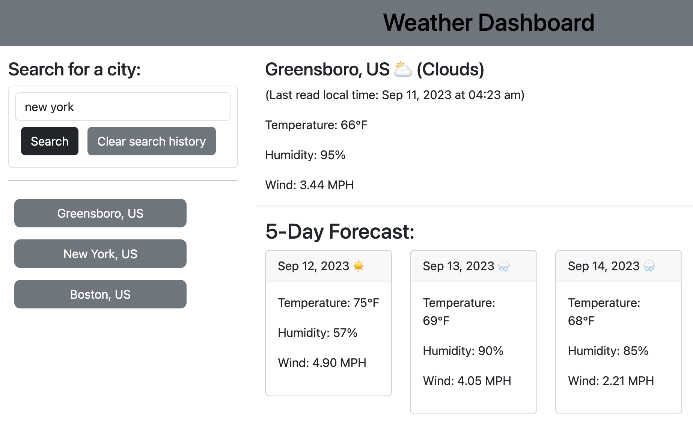

# weather-app
This is a simple Weather Dashboard web application that allows users to check the current weather and a 5-day forecast for a city. It also provides a history of recently searched cities.

## Table of Contents

- [Demo](#demo)
- [Features](#features)
- [Usage](#usage)
- [Installation](#installation)
- [Credits](#credits)
- [License](#license)

## Demo

## Features

- Search for the current weather of any city.
- View a 5-day forecast for the selected city.
- Store a history of recently searched cities for easy access.

## Usage

1. Visit the deployed app using the link provided above.
2. In the left panel, enter the name of a city in the input field and click "Search."
3. The current weather and a 5-day forecast will be displayed for the selected city.
4. The history of recent searches will be displayed in the left panel. You can click on a city name to view its weather again.

## Installation

Visit the provided URL
## Credits

- This App utilizes data from [OpenWeatherMap API](https://openweathermap.org/).

## License

 [MIT License](LICENSE).
